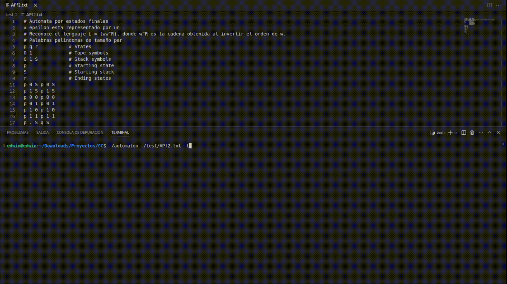

# Práctica 1 - Complejidad de Computadores
## Descripción:
Programa que simula un autómata de pila con finalización por estado final.

El programa lee la definición del autómata desde un fichero y analiza y clasifica las cadenas entradas por consola.

## Compilación:
La compilación se hace de manera estándar con un compilador de c++ como g++ o gpp.
```bash
g++ -o automaton src/main.cc libs/automaton.cc libs/state.cc
```

## Uso:
Pase por argumento la dirección al fichero con la definición del autómata.

Introduzca por consola las cadenas a analizar por el autómata

Si se ejecuta con el argumento "-h" se puede ver una información más detallada del uso del programa en inglés.

Pueden verse definiciones de autómata de ejemplo en la carpeta "test"

### Ayuda:
```bash
automaton -h
```
### Lectura de fichero
```bash
automaton <filepath>
```
### Muestra de la traza
```bash
automaton <filepath> -t
```
### Ejemplo de uso


Autor: Edwin Plasencia Hernández